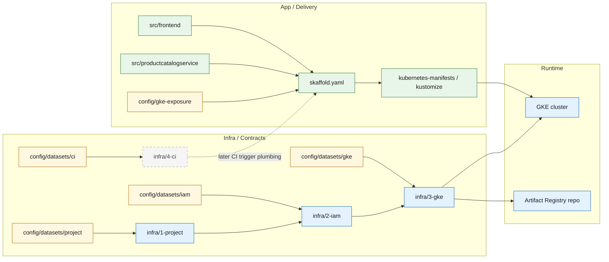

# App To Infra Map

This document shows the current app-first delivery path and where the new staged
infra lane fits around it.

## Active runtime path

The current active app slice remains:

`src/frontend` + `src/productcatalogservice` -> `skaffold.yaml` -> `kubernetes-manifests/` / `kustomize/` -> GKE cluster

The existing proof bind for that runtime path stays under `config/gke-exposure/`.

## New surrounding infra path

The new staged infra lane is:

`config/datasets/project` -> `infra/1-project`
`config/datasets/iam` -> `infra/2-iam`
`config/datasets/gke` -> `infra/3-gke`
`config/datasets/ci` -> `infra/4-ci`

Those stages define the cloud-side contract around the app delivery path, but do
not deploy the workloads themselves.

## Current map

## Selective CFF inspiration

The stage boundaries intentionally line up with small Cloud Foundation Fabric
module families without importing FAST/landing-zone behavior into the app repo:

- `infra/1-project` aligns with project/API enablement concerns
- `infra/2-iam` aligns with service-account and IAM contract concerns
- `infra/3-gke` aligns with Artifact Registry, Autopilot cluster, and later NAT/network placeholders

This keeps the repo compatible with stricter environments later while staying
small and app-delivery-first now.

For the human-run stage order that corresponds to this map, use
`docs/architecture/infra-manual-walkthrough.md`.
