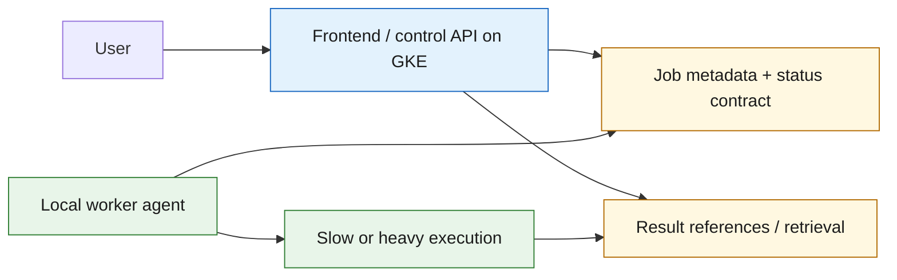

# Hybrid Execution Model

This document defines the next design direction after the current GKE baseline.

## Why this phase exists

The repo now has a stable proof baseline:

- `frontend` in `catalog-only` mode
- `productcatalogservice`
- `recommendationservice`
- staged infra contracts validated on both the simple/public and org-constrained environments

The next major uncertainty is no longer GKE bootstrap or another demo service. It
is the future runtime boundary between the cloud side and the local machine.

## Default architectural assumption

Use this as the planning default until a later decision replaces it:

- cloud remains the front/control-plane surface
- one trusted local worker agent runs on one machine
- the local worker owns slow or heavy execution
- work acquisition starts pull-based
- user-visible status starts polling-based
- no queue infrastructure is required in the first cut

This is intentionally the smallest credible hybrid model.

## Current role of GKE

GKE remains the active runtime baseline for now.

Its job in the hybrid direction is not to host every future workload. Its job is
to remain the already-proven cloud-side surface while the control-plane contract
is defined.

That means GKE currently continues to own:

- the public frontend
- the thin browsing/control plane already in the repo
- the environment-proven deployment path

It does not force the long-term heavy-job runtime to also live in GKE.

## Proposed hybrid shape

## First planning rule

Do not add another boutique service just to keep the microservice demo growing.

If a new component is introduced after this planning phase, it should exist to
support the hybrid boundary itself, not to expand the original shop demo shape.

Concrete payload artifacts for this direction now start in
`config/contracts/job-control/`.

The first minimal cloud-side API surface for those artifacts is described in
`docs/architecture/job-control-api-surface.md` and captured in
`config/contracts/job-control/job-control.openapi.json`.

## Non-goals for the first hybrid cut

- no queue/scaler sidecar model yet
- no multi-worker scheduling yet
- no Cloud Run migration requirement yet
- no stateful data-platform expansion just for demo completeness
- no multi-tenant control plane
