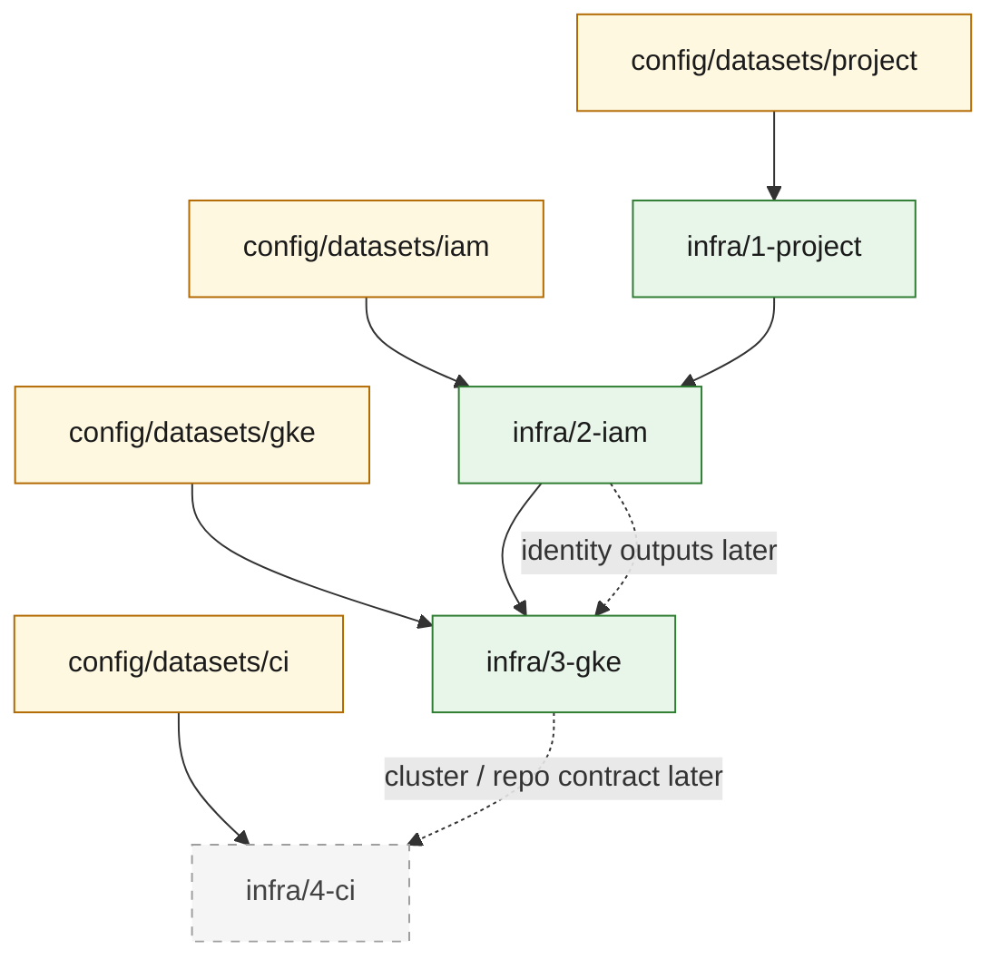

# Infra Dependency Map

This document describes the practical staged-infra topology that is active in the
repository now.

## Active stage chain

The first-pass chain is:

`infra/1-project` -> `infra/2-iam` -> `infra/3-gke`

with `infra/4-ci` reserved as a future contract lane.

## What each stage owns

- `infra/1-project`
  - project adoption
  - minimum API enablement
- `infra/2-iam`
  - optional deploy/runtime identities
  - optional project-role bindings
- `infra/3-gke`
  - Artifact Registry repo contract
  - optional repo IAM bindings
  - optional custom network/subnet contract
  - optional Autopilot cluster creation
  - hardening placeholders for private nodes, control-plane CIDR, NAT, and public LB policy
- `infra/4-ci`
  - placeholder-only CI trigger contract for later work

## Current dependency graph

## Placeholder hardening path

The repo now has a defined place for stricter environment requirements, but those
settings remain off by default:

- `network.*`
- `hardening.private_nodes_enabled`
- `hardening.master_ipv4_cidr`
- `hardening.cloud_nat_enabled`
- `hardening.public_load_balancer_enabled`

That means the repo can describe org-managed environments without forcing those
concerns into the default sandbox path.

## CFF alignment

These stage boundaries intentionally stay close to the kinds of concerns split by
Cloud Foundation Fabric modules, especially:

- project
- iam-service-account
- artifact-registry
- gke-cluster-autopilot
- net-cloudnat

The repo uses that as structure inspiration first, while keeping direct module
adoption as a later optimization choice.
